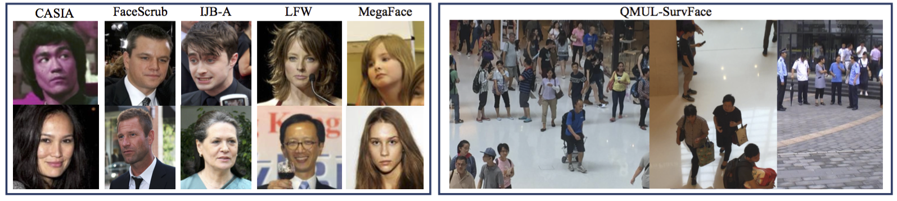
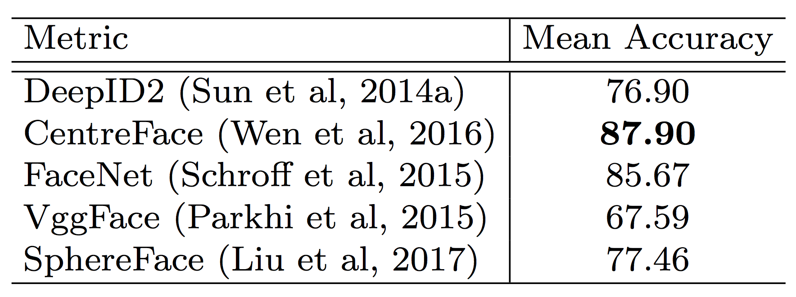

### [Computer Vision Group, Queen Mary University of London](http://vision.eecs.qmul.ac.uk/)
### [Zhiyi Cheng](http://www.eecs.qmul.ac.uk/~zc302/)  [Xiatian Zhu](http://www.eecs.qmul.ac.uk/~xiatian/)   [Shaogang Gong](http://www.eecs.qmul.ac.uk/~sgg/)

### News
Dataset, test protocol and test code: **Coming Soon**
 
### Description
To facilitate more studies on developing FR models that are effective and robust for low-resolution surveillance facial images, we introduce a new Surveillance Face Recognition Challenge, which we call the QMUL-SurvFace benchmark. This new benchmark is the largest and more importantly the only true surveillance FR benchmark to our best knowledge, where low-resolution images are not synthesised by artificial down-sampling of native high-resolution images. This challenge contains 463,507 face images of 15,573 distinct identities captured in real-world uncooperative surveillance scenes over wide space and time. 
Face recognition is generally more difficult in an
open-set setting which is typical for surveillance scenarios,
owing to a large number of non-target people
(distractors) appearing open spaced scenes.

### Download
QMUL-SurvFace Training Images **Coming Soon**

### Benchmark
For details on the evaluation scheme please refer to the [technical report](https://arxiv.org/pdf/1804.09691.pdf). 
#### Identification
Performance curves
(Protocol: Open-Set. Metrics: TPIR20@FPIR (r = 20).)

#### Verification
Metric: Mean Accuracy.

### Citation
@article{cheng2018surveillance,
  title={Surveillance Face Recognition Challenge},
  author={Cheng, Zhiyi and Zhu, Xiatian and Gong, Shaogang},
  journal={arXiv preprint arXiv:1804.09691},
  year={2018}
}

### Contact
For questions, please contact Zhiyi Cheng at z.cheng@qmul.ac.uk